# Remote Pointer

Add a shared, on-screen pointer to any remote-desktop or screen-sharing session, so you can point at and annotate what's on someone else's Windows screen while you talk them through it.

Remote Pointer is **not** a remote-desktop tool and doesn't replace one. It doesn't show you the other screen or let you control their PC — you already see their screen through whatever tool you use (Teams, Zoom, RDP, a screen-share, and so on). What Remote Pointer adds on top is a **temporary** pointer: one or more people draw gestures and short text notes that appear on the other person's real screen, like a laser pointer you can use remotely. Because it drives the host's own screen, it works alongside any remote-desktop or screen-sharing tool.

It only ever sends the *position* of your gestures and the text you type — it never captures or streams the screen, records anything, or moves the other person's mouse or keyboard.

It is built for small, trusted networks (an office LAN or VPN) and runs entirely on infrastructure you run yourself — there is no cloud service and no peer-to-peer connection.

Good for walking a colleague through an app, pointing out details during a screen-share, or remote pair-troubleshooting.

## How it works



Remote Pointer has two roles and a small server that connects them:

- **Host** — the person whose screen is being annotated. A transparent, click-through overlay shows the incoming markers while they keep using their PC normally underneath.
- **Annotator** — the person doing the annotating. In their remote-desktop or screen-share view, they line up a target area over the host's screen, then draw. Their gestures show up on the host's real screen (and so are visible back in the shared view).
- **Relay** — a small server you run yourself that both sides connect to over HTTPS. It validates and forwards gestures; it never touches either desktop.

"Host" names the role, not the hardware: a Host is a client like any other, and the relay is the only thing being *hosted* in the infrastructure sense.

Every annotator must be **individually approved** by the host, and the host can disconnect everyone at any time. A host accepts a limited number of annotators at once (two by default).

## Using it

1. On every PC, enter the relay's **server password** in Settings. It is what gets the client onto the relay at all — without it, nothing connects.
2. Put every PC in the same **room** in Settings. Clients see each other when they are in the same room, and the name is shown back in Settings so you can check it at a glance. Fresh installs all start in `Public`.
3. On the host PC, choose **Available** to become discoverable.
4. On each annotator PC, pick that host from the list and request access.
5. The host approves each request.
6. Annotators line up their target area over the host's screen in their remote-desktop view, then turn on annotating (or press **Ctrl+Alt+P**).

### Pointer controls

While annotating is active:

| Gesture | Draws |
| --- | --- |
| Left-click | Highlight a spot |
| Left-drag | Freehand path |
| Shift + left-drag | Straight line |
| Shift + left-click | Text note (press **Enter** to place it) |
| Right-drag | Box |
| Shift + right-drag | Circle, grown out from its center |
| **Escape** | Cancels the current gesture |
| **H** | Shows or hides the on-screen controls help |

Everything you draw fades on its own after a couple of seconds — nothing is saved on either side. The help panel opens the first time you point and can be reopened any time with **H**; turn off *Show usage hints* in Settings to hide its badge.

As an annotator you see each shape twice: right away in your own target area, and again a moment later in the remote screen you are looking at. *Drawing opacity* in Settings dims your local copy so the returning one stays readable; it starts at 50% and never changes what the host sees.

*Color* in Settings picks what you draw in — seven presets, or any colour you like through the picker. It applies the moment you click, so you can try one out mid-session, and unlike opacity it travels with your drawing, so your partner's screen shows it in the same colour you do.

When several people annotate one screen at once, the server keeps them apart for you: if someone already has the colour you picked, you are moved to a free preset for that session and told so under the swatches. Your own choice is kept, and you get it back as soon as they leave. Past seven annotators there are no distinct colours left and they start to repeat.

## Requirements

- **To use it:** Windows 11. The client is self-contained, so no separate .NET install is needed.
- **To see the other screen:** any remote-desktop or screen-sharing tool (Teams, Zoom, RDP, and so on). Remote Pointer adds the pointer on top; it does not provide the screen view itself.
- **To run the relay:** a machine with Docker, reachable over HTTPS from everyone taking part.

## Installing

Remote Pointer is distributed as a Windows installer. It defaults to installing just for you, which needs no administrator rights; on a shared PC you can instead choose "Install for all users" on setup's first page, which asks for admin. Your settings stay yours either way — every Windows account gets its own relay address, server password, and profile. There is no public download — whoever runs your relay builds and shares the installer. On first launch, the client asks for your relay's HTTPS address; add the relay's server password in the same screen.

- Set up the relay server → [Server deployment](docs/server-deployment.md)
- Build and install the client → [Client deployment](docs/deployment.md)

## Building from source

Prerequisites: Windows 11 and the .NET 10 SDK.

```powershell
dotnet build RemotePointer.sln --configuration Release
dotnet test RemotePointer.sln --configuration Release
```

To try the whole thing on one machine — a local relay plus a couple of client windows so you can play both roles — run:

```powershell
.\build\Start-Development.ps1
.\build\Start-Development.ps1 -ClientCount 3   # or as many as you need
```

Each client gets its own throwaway data directory, so they behave like separate users with
separate names, identities, and saved credentials, and none of them touch the settings of an
installed copy. They all share one relay address and server password, and start in the same room, so they can see each other.
Everything shuts down and the temporary directories are deleted when the last client closes; pass
`-KeepClientData` to keep them for inspection.

## Documentation

- [Architecture](docs/architecture.md) — components, data flow, and design decisions
- [Protocol](docs/protocol.md) — message format and coordinate math
- [Security](docs/security.md) and [Threat model](docs/threat-model.md) — controls and trust boundaries
- [Client deployment](docs/deployment.md) and [Server deployment](docs/server-deployment.md) — building the installer and running the relay
- [Dependencies](docs/dependencies.md) and [Test matrix](docs/test-matrix.md)

## Development

Remote Pointer was developed with the use of AI coding agents.

## License

Released under the [MIT License](LICENSE).
